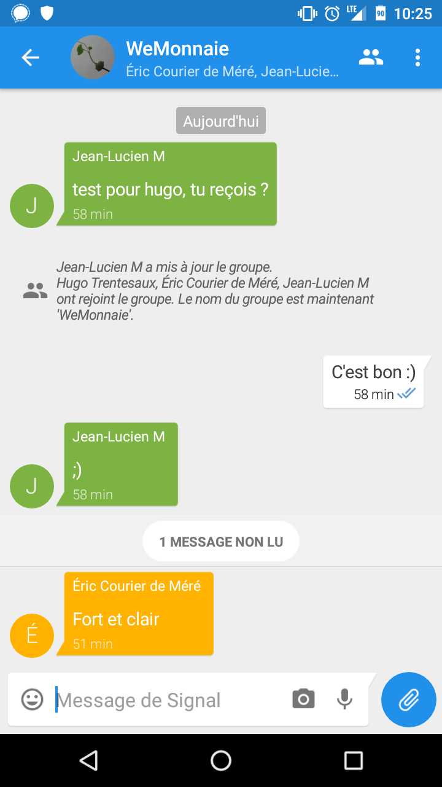

# Indices de sécurité / vie privée

Sur signal

- signal prévient à chaque fois que la clé de sécurité change
- signal affiche un double "check" pour les messages sécurisés

- À l'envoi du message signal propose "texto non sécurisé" (SMS) et message signal
- couleurs différentes gris = neutre, bleu = positif
- l'icône "appel" a un petit cadenas

