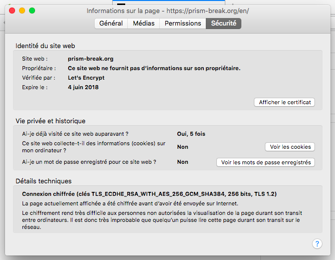

# Indices de sécurité / vie privée

L'objectif de cette page est d'observer les systèmes existants pour voir comment ils informent l'utilisateur du niveau de sécurité.

## Signal / silence
Les interfaces de signal et de silence sont assez similaires.

- signal prévient à chaque fois que la clé de sécurité change
- signal affiche un double "check" pour les messages sécurisés

- À l'envoi du message signal propose "texto non sécurisé" (SMS) et message signal
- couleurs différentes gris = neutre, bleu = positif
- l'icône "appel" a un petit cadenas

- Signal propose de "vérifier le numéro de sécurité". Les chiffres défilent lorsqu'on arrive sur la page, c'est un effet "folklore".
- Un lien "en savoir plus" est proposé, il renvoie vers la question adaptée dans la FAQ de signal.

## Telegram
Je n'ai pas réussi à prendre de capture d'écran d'une conversation sécurisée avec Telegram, mais quand on initialise une conversation sécurisée, il explique en bullet points à l'utilisateur en quoi consiste une conversation chiffrée bout-à-bout.

## Whatsapp / Google Allo / Messenger
Je n'ai pas ça sur mon téléphone, si quelqu'un veut bien jeter un coup d'oeil...

## Firefox

Firefox affiche un verrou vert pour les connections http + ssl et donne la possibilité d'en savoir plus. Les informations supplémentaires sont organisées en plusieurs niveaux.
- niveau 0 : cadenas vert
- niveau 1 : logo vert / bouclier / permissions
- niveau 2 : informations sur le certificat
- niveau 3 : informations complètes et détaillées

- firefox nous accueille avec une ambiance "sécurité" (couleur différente, logo masque...)
- firefox nous explique ce que la navigation privée permet, ce qu'elle ne permet pas

- beaucoup de ressemblances avec firefox
- choix de couleur sombre (gris)
- lunettes de l'espion

## TOSDR
L'extension "terms of service didn't read" prévient l'utilisateur par une pop-up lorsqu'il consulte un site qui a une mauvaise note de protection des données. Voici un example avec Youtube, qui est de classe 'D'.

Au contraire, duckduckgo est classé 'A', et aucune popup requérant une intervention de l'utilisateur ne s'affiche (on peut toutefois l'afficher comme montré ici.

## Duckduckgo plugin

Le plugin de duckduckgo fait à peu près la même chose : il attribue une note aux sites. Exemple : A pour duckduckgo, B pour qwant, D pour google... Il utilise TOSDR.

# TOR
Dans sa vidéo d'introduction, TOR représente l'anonymat :

Un site web n'a pas besoin de savoir qui on est.

Tor valorise l'utilisateur : en utilisant tor, vous faîtes quelque chose de bien, vous protégez les activistes, les journalistes, les contre pouvoirs démocratiques, et les lanceurs d'alerte. Vous protégez la démocratie.

# Conclusions
- on peut créer une "ambiance" de sécurité à travers plusieurs éléments visuels (jeu de couleurs, effets, animations...), les couleurs sombres sont souvent utilisées
- les indices de sécurité sont omniprésents (présents sur chaque bouton) et sont valorisants (couleur agréable)
- on peut donner les moyens à l'utilisateur d'en savoir plus, pour l'inciter à se poser des questions et cherche à y répondre, et cela à plusieurs niveaux de difficulté
- il faut valoriser l'action de l'utilisateur : en protégeant sa vie privée, il rend service à la société.

## Theme
- Faire attention au changement de theme
- caliopen est fait pour augmenter la privacy de manière graduelle, pas binaire

### idées de logo
- cadenas
- bouclier
- masque "d'anonymat" (V pour vendetta)
- lunettes et chapeau "d'espion"
- caméra de surveillance

### idées diverses
- "assistant personnel" type clippy